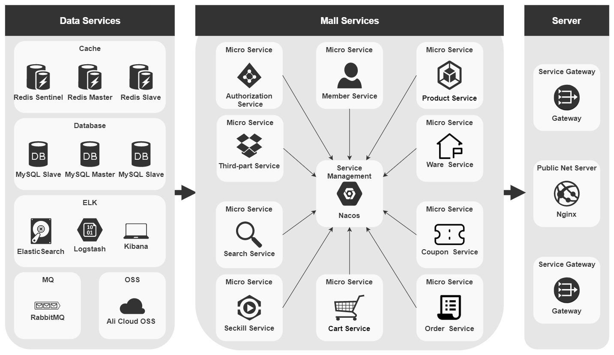

## gulimall

谷粒商城


### 项目模块

```
gulimall 
    ├───khighness-gateway     🌐 服务网关
    ├───renren-fast           🚀 后台管理
    ├───renren-generator      ⚡ 代码生成       
    ├───guliamll-common       🛠️ 通用工具
    ├───gulimall-auth-server  🛡️ 认证中心
    ├───gulimall-third-party  🌠 第三方服务
    ├───gulimall-product      📱 商品服务
    ├───gulimall-member       🤖 会员服务
    ├───gulimall-ware         🏬 仓储服务
    ├───gulimall-order        🧾 订单服务
    ├───gulimall-coupon       🧊 活动服务
    ├───gulimall-search       🔍 检索服务
    ├───gulimall-sso-test     ⭕ 单点登录
    ├───gulimall-cart         🚛 购物车服务
    └───gulimall-seckill      ⚔️ 秒杀服务
```


### 后台架构


<p align="center">

</p>


### 服务提供

- 对象存储：[OSS](https://oss.console.aliyun.com/overview)
- 短信服务：[SMS](https://market.aliyun.com/products/57126001/cmapi00039729.html)
- 在线支付：[PAY](https://opendocs.alipay.com/common/02kkv7)
- 内网穿透：[NAT](https://natapp.cn)
