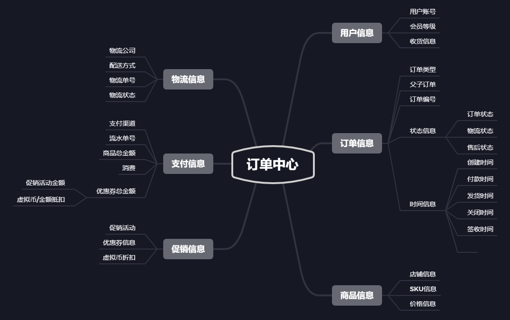
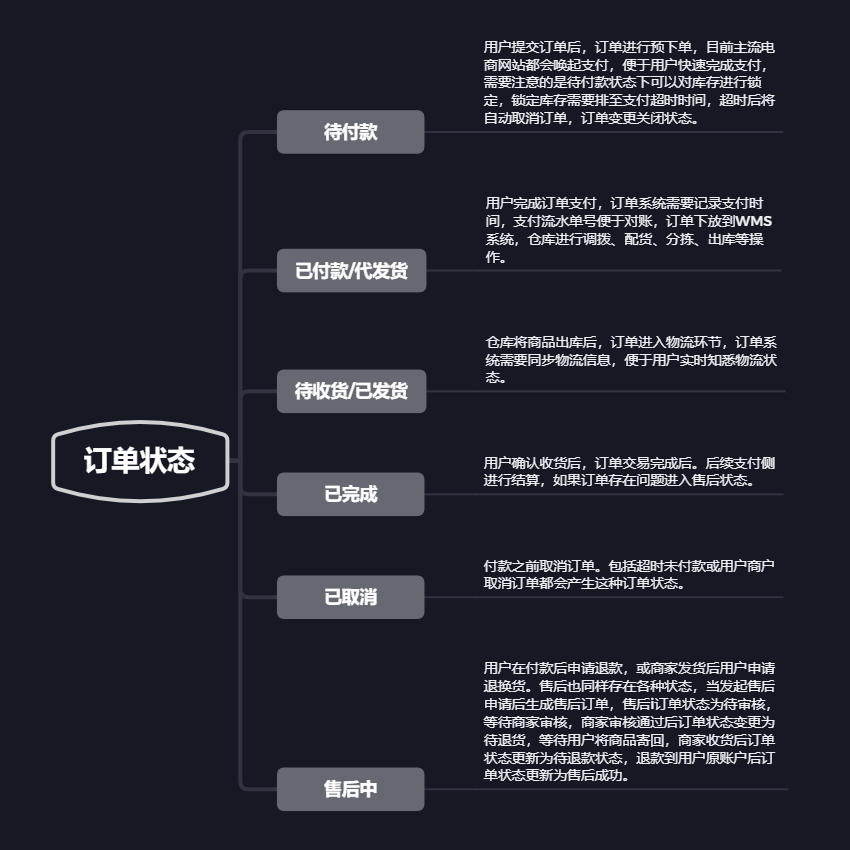

## 订单中心

电商系统设计到三流：信息流、资金流、物流。订单系统作为中枢将三者有机结合起来。

### 订单构成

### 订单状态

### 接口幂等性

1. token机制
2. 各种锁机制
   1. 数据库悲观锁
   2. 数据库乐观锁
   3. 业务层分布式锁
3. 各种唯一约束
   1. 数据库唯一约束
   2. redis set防重
4. 防重表
5. 全局请求唯一id

### 本地事务

本地事务：在分布式系统中，只能控制自己的回滚，控制不了其他服务的回滚。

Spring事务的传播行为：

| propagation   | description                                                  |
| ------------- | ------------------------------------------------------------ |
| REQUIRED      | 如果当前没有事务，就创建一个新事务，如果当前存在事务，就加入该事务，该设置是最常用的设置。 |
| SUPPORTS      | 支持当前事务，如果当前存在事务，就加入该事务，如果不存在事务，就以非事务执行。 |
| MANDATORY     | 支持当前事务，如果当前存在事务，就加入该事务，如果大年不存在事务，就抛出异常。 |
| REQUIRES_NEW  | 创建新事务，无论当前存不存在事务，都创建新事务。             |
| NOT_SUPPORTED | 以非事务方式执行，如果当前存在事务，就把当前事务挂起。       |
| NEVER         | 以非事务方式执行，如果当前存在事务，则抛出异常。             |
| NESTED        | 如果当前存在事务，则在嵌套事务内执行，如果当前没有事务，则执行与 REQUIRED类似的操作。 |

###  分布式事务

下单业务设计到订单服务和库存服务的逻辑和通信。

两个服务只要有一方发生故障就需要全部回滚，因为网络延迟导致的一方成功一方回滚的问题需要解决。

分布式事务诞生的最大原因就是网络问题。

- 机房失火断电；
- 节点崩溃宕机；
- 服务熔断降级；
- 网络波动延迟；
- 消息丢失乱序；
- 存储数据丢失。

谷粒商城的方案：

（1）柔性事务：最大努力通知方案

不保证数据一定能通知成功，但会提供可查询接口进行核对。

（2）柔性事务：可靠消息+最终一致性方案（异步确保型）

业务处理服务在业务事务提交之前，向实时消息服务请求发送消息，实时消息服务只记录消息数据，而不是真正的发送，业务处理服务在业务事务提交之后，向实时消息服务确保发送。只有在得到确认发送指令之后，实时消息服务才会真正发送。

利用消息队列实现最终一致性。

库存服务锁定成功后向MQ发生消息，过段时间自动解锁，解锁时间先检查订单的支付状态。解锁成功修改库存工作单详情状态为已解锁。

